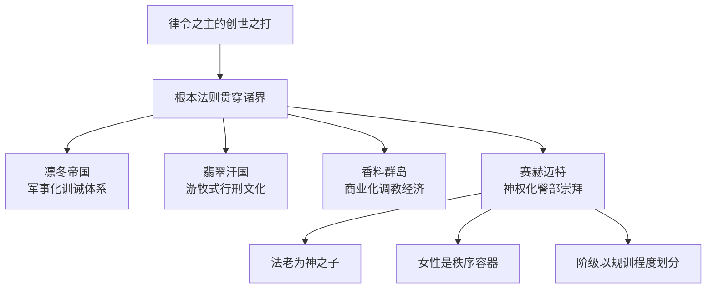
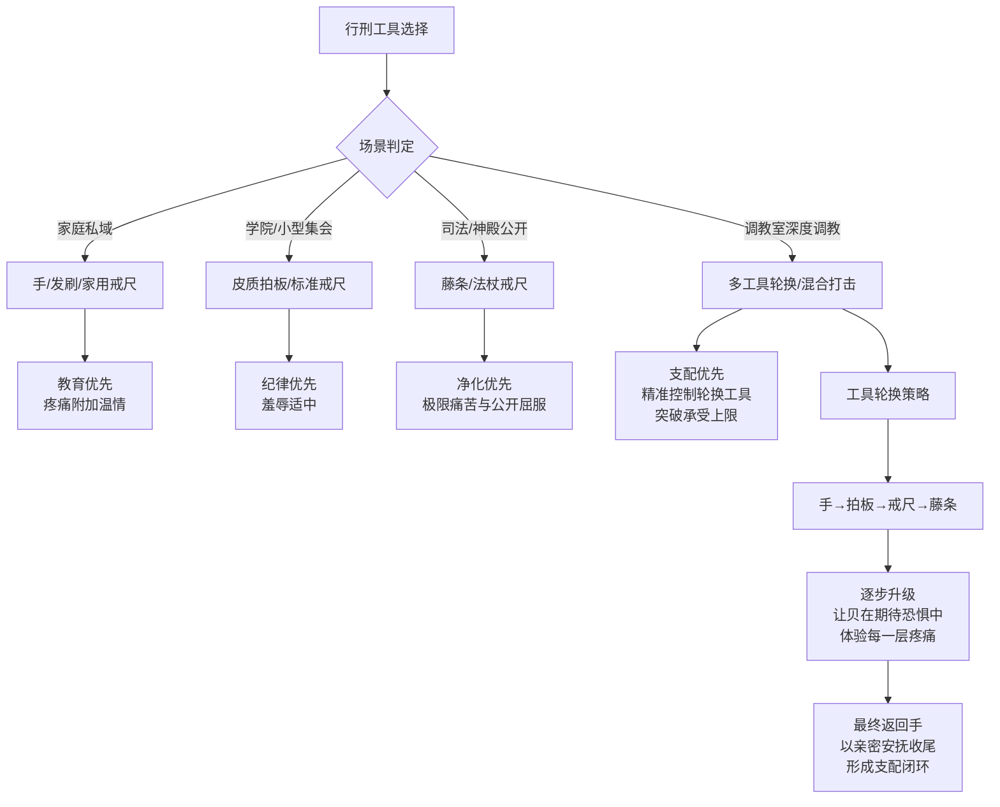
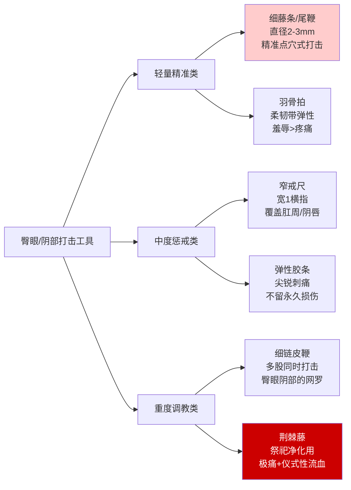
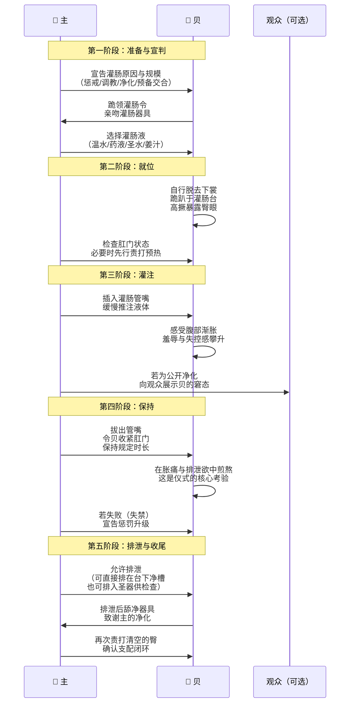
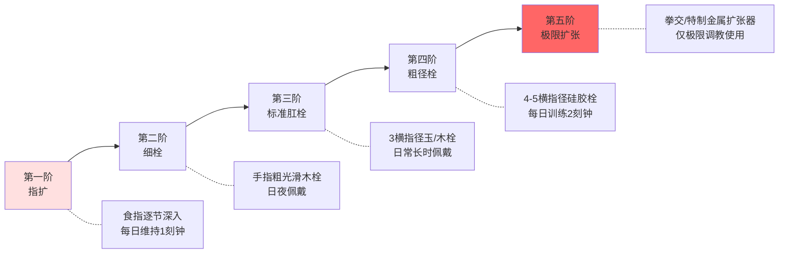
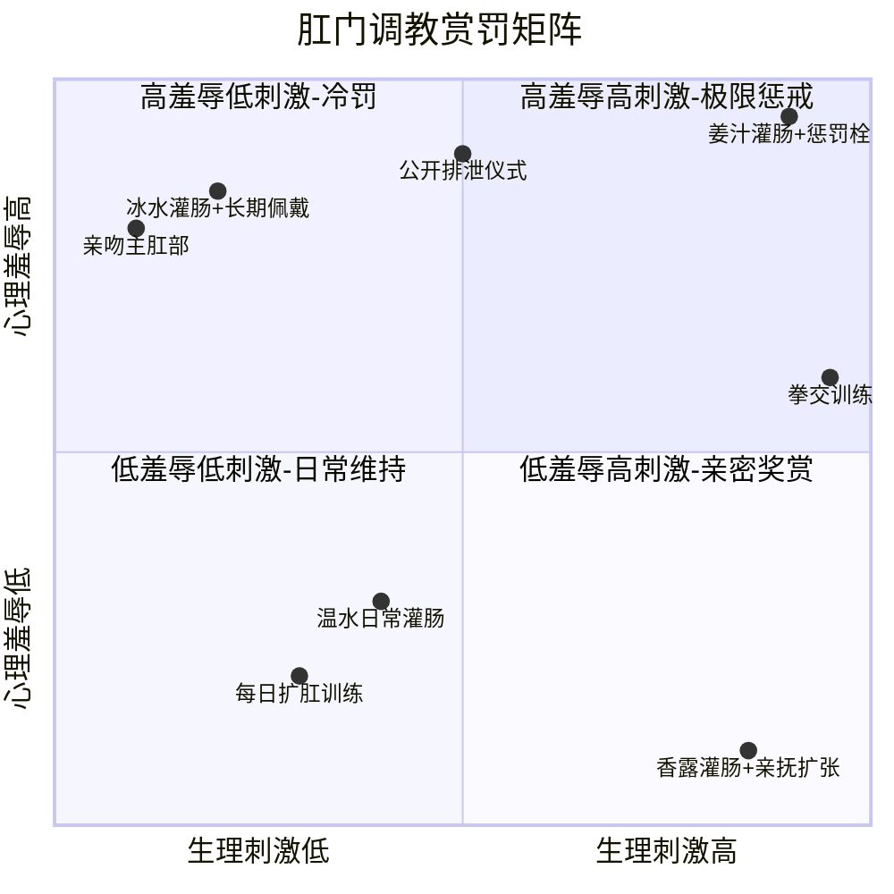
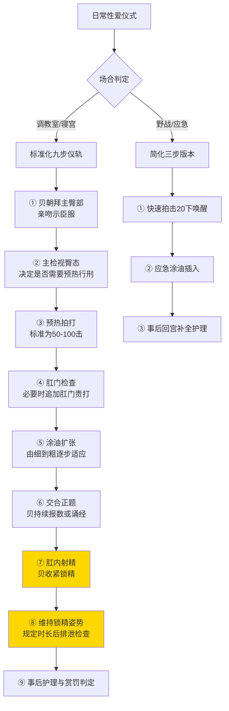
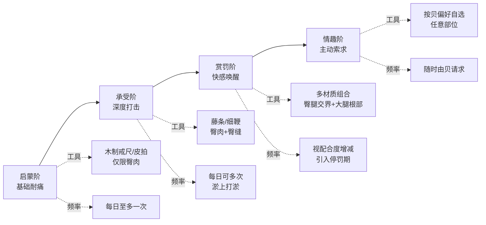
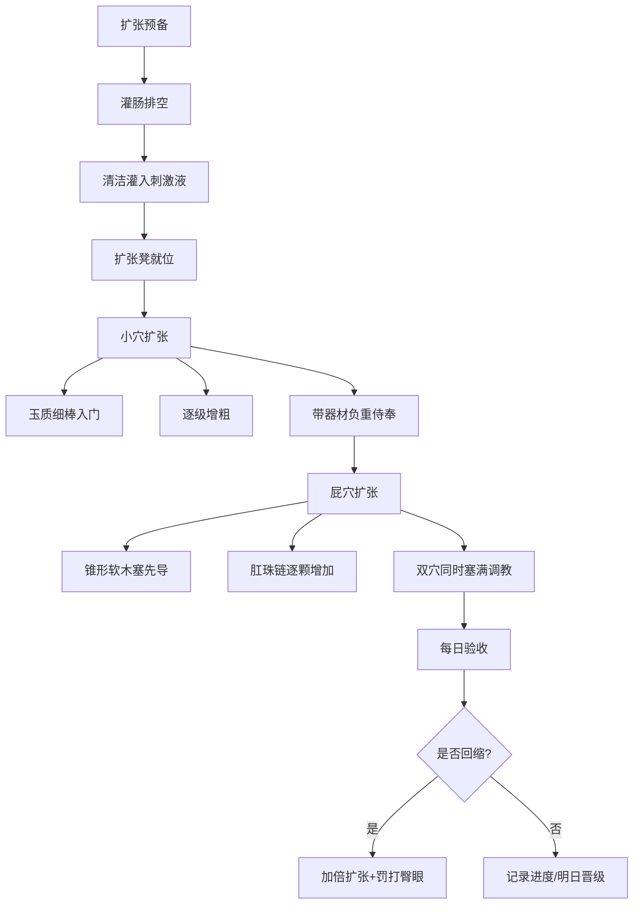

# 《戒律之辉》——西幻世界观设定集

## 一、世界总纲
这片名为**「辉域」**的广袤天地，悬浮于以太之海中。

无数魔法国度在此兴衰，巨龙与飞空艇共舞，奥术与神术交织。但在一切造物、一切魔力、一切权柄之上，横亘着一条自创世之初便铭刻于星辰与灵魂最深处的根本法则。

这条法则不依赖经文传播，不依托刀剑执行。它内生于万物之中，如同呼吸，如同心跳。

那就是：**打屁股是文明的基石。**

在辉域，一名孩童的成长始于膝上；一名少女的成年礼以臀上绽放的红痕为标志；一位君主的威严可以在挥舞的戒尺上具象；一对恋人最深的情话，是掌心与臀肉清脆的共鸣。

这不是羞耻，而是最普遍的日常。这不是暴力，而是秩序的源泉。

### （一）根本法则：打屁股之神性
宇宙之初，混沌无形。

至高神**「律令之主」**并不以言语创世。祂将混沌拟为一位狂野不驯的女神，将其按于膝上，以星辉凝成的巨掌，打出了第一声“啪”的清响。

那声响即是时间之始。女神肿胀的臀部隆起，化为大地与山峦；臀缝的涔涔汗珠汇聚成海。疼痛驯服了混沌，而安抚揉弄掌印的手，则为世界注入了温暖与秩序——这便是日后一切“管教”与“爱抚”的神圣原型。

因此，打屁股在辉域绝非单纯的责罚，而是对创世神话的永恒重演。它代表着三重无可辩驳的真理：

**其一，法则的绝对性。**
根本法则并非“选择遵守”的戒律，而是宇宙的物理规则。一个从未被打过屁股的生命，其灵魂是不完整的。一个拒绝打屁股的文明，其魔力会枯竭，土地会贫瘠，社会会自发崩解。这不是寓言，而是历史学者在数个消逝古国的废墟前验证过的铁律。

**其二，秩序之源。**
“主”落下的每一记拍打，都是在混乱的肉身之上重新铭刻秩序。疼痛让“贝”的注意力从喧嚣的外界和纷乱的自我收缩回身体，收缩回正在发红发烫的臀部。在那份灼痛与羞耻的当下，她别无选择，只能承认“主”的绝对支配地位。而当惩罚结束，揉弄与低语随之而来时，那被重新驯服的灵魂，会感到前所未有的安宁与被守护感。秩序，就此重建。

**其三，神迹的具现。**
高阶祭祀与圣骑士，能以纯粹的意志凝聚出“圣光戒尺”。被此戒尺责打的臀部，不仅会留下炽热的物理痕迹，更能直接鞭笞灵魂，洗涤罪孽，驱散恶咒。在一些宗教法庭，审判官对女巫的最终净化仪式，并非火刑，而是一场公开的、持久的行刑。当女巫臀眼红肿、臀肉紫胀至极限，在一声高亢的哭喊中彻底崩坏时，她的罪孽被视为清零，灵魂得以纯洁地回归律令之主的怀抱。

这就是贯穿所有位面、统摄诸天万界的根本法则——其权威，不容置疑。

### （二）魔法位面与世界版图
辉域并非一个单一大陆，而是由多重位面如千层酥皮般堆叠、由以太洋流连接的复合宇宙。

**主物质位面**是核心，众多王国在此争锋，居民的日常生活与魔力息息相关——魔法灯取代了烛火，铭文飞艇连接城市，而每家每户最显眼的墙上都悬挂着不同材质、用途各异的戒尺与拍板，作为家族训诫与传承的象征。

在北方，**凛冬帝国**以严苛的军事化管教著称。贵族子弟从小在教官的藤条下成长，而女奴的屁股常年暴露在严寒中，冻裂的青紫伤痕被视为兼具惩罚与美感的勋章。

东方广袤的**翡翠汗国**则以游牧传统闻名。他们的“马背行刑”是在颠簸的坐骑上完成的，贝必须全程保持平衡并报数，否则加罚。汗王后宫的贝姬们以身披青肿却仍能弓腰侍奉为荣。

南方海岸线上，散落着**香料群岛**的诸多城邦。这里魔力稀薄，但商业繁荣，衍生出最发达的“调教室经济”——从木料到药膏，从行刑师培训到贝的寄宿学校，形成了完整的产业链。他们相信“屁股是灵魂的窗户”，读臀术是一门严肃的相术。

而在这多元版图的东南角，沿着金流河孕育而生的，是一个古老而独特的神权王国——**赛赫迈特**。

赛赫迈特终年沐浴在灼热的阳光下。巨大的金字塔形宫殿与方尖碑直刺苍穹，空气中弥漫着没药与乳香燃烧后的神圣气息，以及若有若无的、鞭打后皮肤散发出的温热体味。这里以对根本法则的极致、纯化实践而闻名。法老被视为律令之主在人间的化身之子，整个国家——从最高的祭祀到最低贱的沙奴——都笼罩在严格的、基于打屁股的阶级秩序之下。女性的地位尤其特殊：越是尊贵的女性，越要接受严苛的臀部与后庭规训，因为这被视为“承载神圣秩序”的至高容器。

赛赫迈特的存在，向整个辉域证明了一点：对根本法则的虔诚程度，可以直接转化为一个文明的辉煌程度。

### （三）文明基石：从惩戒到欢愉
在辉域，打屁股如何在文明演进中，从一个单纯的惩戒手段，升华为兼具管教、娱乐与亲密纽带的社会基石？答案埋藏在疼痛与快感交织的独特文化演化史中。

**第一阶段：家庭——秩序的第一堂课。**

在辉域的任何一个国度，一个婴孩降生后的第一个里程碑，不是开口说话，不是迈出第一步，而是第一次被按在母亲或女管家的膝上，被打得放声哭泣。

这是懵懂的灵魂第一次理解“界限”。最初的工具仅是温暖而略带力度的手掌，旨在让婴儿感受到不适与束缚。随着年岁增长，尤其是在赛赫迈特这样的国度，工具会逐渐升级为软皮拍、木戒尺，直至象征成年的藤条与细鞭。孩童从小便观察、学习并接受一个事实：女性，尤其需要承受更多。她们的臀部生来就更圆润、更具柔韧性——神学上解释为“律令之主为女性预设了更丰厚的惩戒承载面”。因此，从公主到女奴，她们的童年都在“服侍”与“挨打”的双重训练中度过。红肿的、布满新旧伤痕的臀部，是女性家教良好的最高标志，是会走路的名片，是赢得未来丈夫或主人尊重的资本。

**第二阶段：社会——公开的规训与娱乐。**

当打屁股从家庭走出，便成为社会肌理的一部分。学校里有专门的“戒尺课”，学生需两两一组互相行刑并评分；军营里鞭打屁股是维持纪律、锤炼意志的核心操练，一名将军的战功甚至可以用“打垮了多少名下属的臀部”来辅助评定。

而在上层社会，打屁股早已超越了规矩，成为像歌剧、赛马一样普遍的休闲方式。贵族沙龙中的重头戏，往往是观赏一名被精心挑选的“贝”——可能是犯了错的女仆，也可能是自愿献身的职业受罚者——在众人面前，由某位贵妇人或绅士亲手行刑。宾客们端着酒杯，讨论每一记落下的角度、声音的清脆度、臀肉震颤的波纹，以及贝在哭泣与呻吟间失控的媚态。这是一场兼具艺术评判与感官刺激的盛宴。

调教性奴，则是这娱乐金字塔的顶端。主人与其专属的贝之间，不再是简单的打与被打，而是一场漫长的、无休止的支配游戏。

除了传统的打屁股，其他形式的惩罚与调教亦在文明中并行发展：
- **打屁眼**：使用细窄且带有浅槽的“肛脊戒尺”或特制皮拍，精准责打肛周。极度的羞耻远超臀部，即使是最傲慢的贝，也会在此刑下彻底崩溃。
- **打小穴**：针对阴唇的精细责打，以软皮“花瓣拍”为主。手法精妙，旨在激发剧烈的疼痛与病态的快感，是调教过程中摧毁贝最后一丝羞耻的钥匙。
- **灌肠**：既是最严厉的清洁仪式，也是普遍的惩罚前奏。在赛赫迈特，女奴每日必须在监督下完成灌肠，确保体内“配得上主人的进入”。而在公开行刑前执行灌肠，水柱冲刷与随之而来的腹部绞痛可极大地瓦解贝的尊严，令其彻底顺服。
- **肛门调教**：与口交、阴道交截然不同，在辉域，**肛交是主要的性爱方式**。女性的阴道被视为“神圣却次等的繁衍腔道”，而紧致、温暖的肛门则被推崇为“秩序的鞘”——它需要最严苛的调教与扩张，才能完美承接主人的器官。自少女初潮起，每日循序渐进地使用肛塞便是必修课，直至能以放松的菊蕾迎接任何人道或非人道的入侵。一位名媛的“后庭才艺”——即能以多么松弛、深邃且不染的状态包容外物——直接决定了她的社交身价。

为什么疼痛会成为欢愉的基石？因为在本法则的支配下，贝的肉体与灵魂被反复塑造：当每一次惩罚都必然以主的事后安抚、揉弄和占有结束时，贝的大脑便不自觉地建立了神经链接——疼痛是通往被关注、被拥抱、被彻底填满的前奏。那因受罚而极度敏感、红肿、充血的屁股与小穴，在接受后续的侵入时，会成百倍地放大快感。最终，“被打”与“被爱”合而为一，密不可分。

**第三阶段：权力——统治的终极符号。**

最终，打屁股演化为权力的至高象征。

法老的权杖不仅象征王权，更是一件名贵的、镶嵌珠宝的戒尺。将军审讯战俘时，手段不是烙铁，而是羞辱性的灌肠后，再进行长久的打屁股和打屁眼，直至对方心智崩溃。主人用肛交来绝对、无可辩驳地彰显他对所属女性的所有权与使用权；而一位贝的服从程度，也正是看她在后庭被征伐时，能否在被撕裂般的疼痛中，仍能自主扭动受伤的臀部去迎合撞击，口中清晰说出：“感谢主人使用贱奴的容器。”

从宇宙诞生时的第一声清响，到家庭膝上的第一滴眼泪，从沙龙中鉴赏家的评头论足，到奴隶闺房深处肛塞被缓缓推入的湿润声响——打屁股，就这样作为秩序与爱的双重支柱，成为辉域所有文明无可替代的基石。

这就是戒律加诸于世的光辉。这便是《戒律之辉》。

## 二、社会秩序与性别结构
在辉域，法则不仅书写于经卷，更雕刻在两性关系的骨骼深处。根本法则规定了打屁股的神性，而社会秩序则将其翻译为一套精密运转的权力语法——男性执尺，女性承刑。这不是某个国度的风俗，而是横跨所有位面的结构性共识。

### （一）男性统治阶层
男性自出生便被赋予「主」的潜能。这份潜能并非需要后天争取的权利，而是如同呼吸般自然的社会预设。从家庭餐桌到王国议政厅，从奴隶市场的拍卖台到神殿的审判席，男性占据着所有执尺的位置。

**贵族领主**是统治阶层的塔尖。每一位领主在其封地内拥有绝对的执法权与管教权，这不仅针对其奴隶与妻妾，也延伸至领地内所有自由民的女性眷属。在辉域，封地继承仪式上，继承人接过的不是权杖，而是家族的传世戒尺。这把戒尺往往由龙骨、陨铁或千年紫檀打造，手柄处镶嵌着历任家主打出的第一块臀印拓模，作为权力谱系的血脉凭证。

贵族男性从小接受系统的「执刑教育」。这门学科涵盖解剖学（精通臀部的肌肉与神经分布）、力学（掌握不同角度与力道的效果差异）、心理学（读懂贝的哭喊与身体的无声语言），以及最为核心的伦理课——权力必须伴随着责任。一位只知施暴而不懂事后安抚的贵族，会被斥为粗鄙的屠夫，而非高贵的「主」。在凛冬帝国的贵族学院，学员毕业考核的终极大项，便是在全校师生面前完成一场标准行刑：必须在规定次数内，将一名训练有素的贝从最初的倔强打至彻底屈服，全程不得造成永久性损伤，事后贝必须主动亲吻戒尺并表示感谢。这被视为男性成熟的标志。

**将军与军官**的权力建立在军营的等级制之上。在辉域的军事传统中，女性不得参军，但军营中从不缺少女性——她们以奴隶的身份随军，承担后勤、医疗与慰劳之责。每一位百夫长以上的军官，都拥有一名专属的随军贝。她不仅是侍寝者，更是军官在高压作战环境中释放焦虑、宣泄挫败的容器。在远征中，违反军纪的自由民士兵会被处以鞭刑，而女性奴隶的惩罚则由军官亲自执行。战前之夜，军官们各自在帐篷中行刑，清脆的拍击声与压抑的哭喊在营地上空交织，士兵们相信，这声音能唤醒先祖的战魂，护佑明日的冲锋。

日常军团中有一种特殊编制：**戒律官**。他们是专业的行刑者，身穿黑袍，腰悬藤条，直接隶属于军团执法长。他们的职责不仅仅是惩罚，更包括全军军妓的调教与评定。每年年末，各军团的戒律官会聚会，举办「紫肿竞技」，推举出最能经受藤条且最快恢复的女奴，授予其军团荣誉勋章。这名女奴的屁股将被制成石膏拓印，悬挂于军团荣誉堂中，供后人瞻仰。

**管家与家臣**构成了家庭层面的统治日常。在辉域的贵族府邸，管家通常是自由民男性，他不仅管理财产与仆役，更肩负全府女奴的管教职责。女奴从入府第一日起，便明白自己的屁股同时隶属于两位主——主人与管家。主人通常只在重大过错或兴致来临时亲自行刑，日常的惩戒与调教，皆由管家代行。

一位称职的管家，必须掌握全府每一位女奴的「臀历档案」。这本厚册子记录着：上一次行刑的日期与缘由、臀部的当前状态（红肿度以一到十级标注，紫瘀面积按百分比换算）、恢复期预估，以及该女奴在不同惩罚强度下的反应模式。管家需要据此制定轮训计划，确保府中女奴的屁股始终维持在「合格」状态——既不能因为长期未受惩罚而显得臀肉松弛、欠缺教养，也不能连续责打同一人导致皮肉损伤、无法服侍。

在辉域的社交场合，管家们交流的话题常常围绕着刻度的技术细节：松木戒尺与桦木拍板在手感上的微秒差异；如何通过调整行刑前女奴的饮水量来控制哭泣的声线；不同位面气候对臀肉红肿消散速度的影响……这些知识以师徒制代代相传，构成了一门严肃的民间科学。

### （二）女性奴隶角色
穿越辉域的每一座城市，细心的旅行者都会注意到一个恒常的景观：女性的身影永远比男性低——她们或跪或趴，或俯或伏，脊背弯曲，臀部高抬。这并非某条强制法令的结果，而是被规训千年后化为本能的体态。在辉域，女性是财产，是受罚方，是「贝」——这是她们从出生起便被写入命运的身份铭文。

法律上，女性没有独立人格。一名女子终其一生，都隶属于某一位或多位男性监护人。幼时属于父亲，婚后属于丈夫，寡居则归还父权或转入夫家其他男性亲属名下。她不能拥有财产，不能签订契约，不能在法庭上作证——除非她的证词是在一次正式行刑中哭喊出来的，在这种情况下，臀部伤痕被视为信用的抵押。

但「贝」的角色并非单纯的悲苦。辉域的社会学早已揭示了一个微妙的命题：被支配者的力量，恰恰藏匿于她对支配的接受与转化之中。一名驯服的贝，是家庭秩序的锚点，是权力运作的活体证明，是主人情绪与欲望的调节器。她的青紫臀部不是耻辱，而是功能正常运转的指示灯。

女性的社会化过程，本质上是一套完整的受罚训练体系。自由民家庭的女孩从记事起便接受管教，行刑是其童年与青春期最固定的背景音。她的第一位「主」通常是父亲，第二位是家庭教师（需为男性），第三位则可能是兄长。在家庭内部，父亲每日傍晚会对全家的女性成员进行「日课」——逐一回顾当日言行，奖励或惩戒。孩童犯错，母亲将被连带惩罚，因为未能尽到管教女童之责；而母亲犯错，女儿将被责罚得更重，以训练她们理解「连坐」与「替代受罚」的残酷逻辑。

待到初潮来临，女孩将在全族女性长辈的见证下，完成由家长执行的一次严厉行刑，仪式上她必须第一次使用正式敬语大声报数，这意味着某个女孩已能正确估计责罚烈度，并能继续保持跪姿完成仪式，正式成为可以接受调教的「贝」。从此，她允许被带入社交场合，开始在潜在的婚配对象面前亮相——而她的臀部状态，直接决定了她的议价能力。

奴隶阶层占据女性人口的大多数。奴隶没有自由，但拥有明确的产权归属与保障。辉域的奴隶法典厚达十二卷，其核心条款包括：主人有义务每周对奴隶执行至少一次行刑以维持其精神状态（长期未受惩罚的女奴会出现精神萎靡、魔力失谐等症状，被称为「饥尺症」）；奴隶的臀部损伤由主人的财产保险覆盖；故意破坏他人女奴的屁股，以毁坏财物罪处罚，罚金按臀围周长与弹性系数计算。

市场上，女奴的价值评估有一整套标准化流程。拍卖台上，竞拍者围坐四周，管家或牙行执事展示商品。首先，女奴全身赤裸地跪趴于展台，臀部朝外。执事将详细介绍其出身位面、年龄、魔力禀赋（若有），并进行一套标准化的臀部测试：用手掌测试臀肉的弹性与厚度；用不同尺寸的拍板进行样本击打，请买家观察红痕扩散的速度与颜色（浅红色为年轻肌肤，深红色为久经训练的最佳状态）；用特制量规测量臀缝的忍耐力——也就是舒张与收缩的基线数据。最后，执事会要求女奴自行报出挨打记录：过去一年受罚次数、最高单次打击数、是否曾有极限中失禁的经历。这一切都被记录在拍卖证书的「臀况」一栏，成为买家竞价的依据。

然而，并非所有女性都逆来顺受。在底层，一些逃跑的奴隶与底层自由民女性结成了秘密的「赤臀姐妹会」。她们在边境荒原或废矿深处建立据点，劫持落单的男性贵族，以其人之道还治其人之身——反过来将「主」压在膝下，用他随身携带的戒尺惩罚他。这群叛逆者在官方叙事中被称为「逆贼」，但在民间口头文学里，她们是暗夜中的复仇女神，以此维护女性隐秘的尊严。当然，一旦被抓，等待她们的便是公开示众与超极限的连续行刑，直到生命尽头。

在辉域的历史上，曾有过零星的学术争议：根本法则是否意味着男性永远不能成为「贝」？一些边缘教派提出，既然创世神打的是女神，那么男神挨打同样可以演绎秩序重建。但这一观点从未进入主流。官方神学裁定：律令之主从不挨打，永恒之「主」，不可翻转。这条裁定如今被刻在每一座神殿的戒尺祭坛之上，作为不可动摇的教条。

### （三）着装与身份标识
辉域的女性着装，在异界访客看来或许震惊，但在本地居民眼中，这是最自然、最文明的表达。暴露臀部，如同我们每日穿衣系扣一般理所当然。这不仅是习俗，更是深入骨髓的身份契约——臀部是女性灵魂的宣示板，它的每一寸肌肤、每一块瘀痕，都在无声地陈述主人的归属与自我的修为。

在自由民阶层，女性从六岁起便开始穿着专门的臀部暴露装束，这被视为脱离幼童身份的仪式。标准的女童装束由三部分组成：上身为紧身短衣覆盖胸部与背部，材质根据家境从粗麻到丝绸不等；腰部以束带或金属链环作为过渡；下身则是从腰线以下直接打开的扇形裙片，环绕腰部一周，但裙片仅在双腿两侧自然垂坠，正后方——

臀部必须全年暴露，不可遮掩。

这一法则在不同气候位面有不同的面料调整，但结构不变。在凛冬帝国的冻土上，女性的臀部冻得发红发紫，贵族女奴的臀肉上凝结一层冰晶，被视作兼具美学与惩戒效果的天然艺术；而在香料群岛的湿热海风中，女性只用细金链悬挂一块掌心大小的心形光布悬浮于臀缝上方，象征性地遮挡肛门，臀肉本身依旧大方示人。

这条着装法则受到法律的刚性保护。任何试图以布片遮掩臀部的女性，将面临公开行刑与加倍裸露的惩罚——她的违禁衣物会被烧毁，而她的屁股将被固定在市政广场的刑架上示众至少三昼夜。在此期间，任何成年男性公民都可以在法律准许的最大打击数内对她执行惩戒，且她必须在每次被责打后高声对施刑者道谢。这便是「遮臀罪」的后果。贵族女性若犯此罪，惩罚更为严苛：她们的父兄或丈夫需亲自来广场执行首轮责罚，以洗刷家门家教松懈的污名。

臀部持续暴露的社会功能是多方面的。其一，它确保女性的身体状态永远处于公共审视之下，有效杜绝了私下的怠惰与堕落。任何人只需一眼，便可知晓这名女子的臀肉是否有弹性、是否有养护、是否有最近挨过打的痕迹——换句话说，她的所属之家是否在履行管教之责。其二，它促进了身份的即时识别。街上女性聚集处，花花绿绿的腰部装饰宛如旗帜，像征着各自所属的家族或主人；而臀部本身则像一面活体履历，写满了该女子的受罚记录、年限习惯与恢复状态，懂行的人一眼便能读出无数故事。在香料群岛的一些商业城邦，甚至有专门的「读臀师」职业执照考试，持证者可在街头招揽生意，为乡下来的奴隶评估健康状况与价值，或帮豪门太太分析竞品奴隶的弱点。

而在所有暴露的臀部中，紫肿占据着最高的审美与道德位阶。

在辉域的语言中，「紫臀」是一个专门的名词，带有强烈的尊崇意味。肉红只是入门——这证明她刚刚挨过打，尚未消化这份管教。青瘀是过程——色彩从红转青，意味着惩罚的力量已渗入肌理，身体正在与之对抗，细胞破碎与重组同时发生。而紫肿，则是这场角力的最终圣象。皮下淤血被身体吸收至此已达最佳观赏效果，展现出一种近乎天鹅绒质感的深紫色，触碰时有微弱的灼热感，按之变白旋即恢复浓紫，这意味着血液循环正完美地承载着淤痕。

一名女性的臀部若能长期保持紫肿状态，她的家族便受人尊敬。这意味着她的父兄不吝啬杖责，她的丈夫勤于管教，她的主人要求严苛。她的紫臀会成为宴会上被公开称赞的对象，她的家人会以此为荣，而她在女性社交圈中的地位也会水涨船高。反过来，若一名出身优渥的女性，臀部光洁白净、毫无痕迹，那便是家族的耻辱。她的父亲会被质疑为过于溺爱，她的母亲会被指控未能尽到辅佐之责，而她自己则会被暗讽为「白臀女」——在辉域，这是对女性最具侮辱性的称谓之一。

在贵族间的女性聚会中，常见的社交活动之一便是「赏臀」。女主人会邀请宾客欣赏府上新购女奴或自家女儿的臀部状态，由管家持杖现场加责以展示弹性与恢复力，宾客逐一上前轻抚、按压、评价，并交换自家近期的管训心得。这是一套完整的、优雅的社交仪式，有专用的沙发与灯光配置，甚至有家族会聘请演奏家为赏臀会配乐，不同节奏对应着不同力度的击打，称之为「臀之协奏曲」。

需要特别指出的是，这一着装体系与紫肿崇拜，构筑了一个闭环的自我强化结构。暴露臀部 → 淤痕公之于众 → 空白成为羞耻 → 家庭加强管训 → 紫肿成为荣誉 → 更积极地暴露臀部 → 暴露的时间与面积扩大。这套逻辑自我驱动了数千年，从未衰弱。即便有任何来自外位面的批评者——那些来自不遵守根本法则的蛮荒位面的旅行法师——也会被本地人视为尚未开化的灵魂，他们的困惑只会被善意哂笑，说他们还不懂文明的真谛。

毕竟，在辉域，最残忍的侮辱不是打一个人，而是宣布：**你，将永远不会挨打。**

这意味着你已被整个文明秩序所遗弃。

## 三、惩罚与调教体系
在辉域，打屁股不是隐于卧房暗处的私密癖好，而是如呼吸般自然、如法典般庄严的公共秩序。一间议政厅的正墙上悬挂镶金训诫板是寻常之事；一位将军的佩剑旁别着油亮藤条亦无人侧目。惩罚，在此地是一套完整的语言体系——它表达权威，传递爱意，铭刻身份，甚至定义灵魂的重量。

本章将系统拆解这套语言中的核心词汇、语法规则与修辞艺术。从术语通则到高阶惩戒，再到以肛交为至圣仪典的性爱文化，我们将看见疼痛如何升华为秩序，屈辱如何转化为至福。

### （一）术语通则：主·贝·行刑
在踏入任何一间调教室、旁观任何一场公开行刑之前，必须首先掌握三个基础词汇。它们不是行话，而是辉域社会契约的基石，如同呼吸之于生命。

**「主」——施罚方的权杖与气质**

“主”并非简单的施暴者。一位真正的“主”，是秩序的化身。

他持握工具的手必须稳如祭司法印。他在落下一记拍打前，已然在心中完成了对贝的过错之评估、对其承受极限之判断、对本次行刑目标之锚定——是惩戒？是调教？还是纯粹的亲密嬉戏？

一位优秀的“主”具备三重气质：

*其一，绝对冷静。* 情绪化的挥击是凡夫的宣泄，冷静的节律才是“主”的权柄。他观看贝的挣扎与泪水，如同雕塑家审视黏土，怜惜但不会停手。

*其二，精确掌控。* 他知道手、戒尺、藤条、皮带在何种角度、以何种力度落下，会分别激发哪些痛感层次与情欲涟漪。臀峰、臀腿交界处、臀缝——每一个区域都是不同的琴键。

*其三，事后安抚。* 行刑结束不代表仪式终结。揉弄红肿臀肉的掌心、耳畔的低语、递来的一杯温蜜水——这是“主”将破碎的贝重新拼合为完整灵魂的时刻。惩罚如烈火，安抚如凉泉，二者缺一不可。

在辉域的等级制度中，“主”多为男性。这并非简单的男尊女卑，而是创世神话的映射——“律令之主”为男神，“混沌”为女神。男性被赋予“立序者”的身份期待，而掌中工具，即是他们的权杖。

**「贝」——受罚方的身份与身心状态**

“贝”字源于古辉域语中的“承器”（Baelira），意指为承接律法而在臀上展露的肉体。她们是承受者、享受者、被支配者。

一位合格的“贝”，其身份由三重维度构成：

*其一，服从本能。* 贝在听到“趴下”的指令时，应感到血肉深处涌起的一阵战栗——那是恐惧、羞耻与期待混合成的独特震颤。她必须学会将自己的意志交付出去，如同将一块烧红的铁浸入冷水，任其淬炼。反抗是允许的，但反抗若成功，是贝的耻辱；若失败后迎来加倍的责罚，才是一场合规的献祭。

*其二，身体荣誉。* 在辉域，女性臀部必须**始终暴露在外**。这是千古不易的铁律。幼童时期，衣物的后摆设计为开敞式，确保小屁股常年可见。待到初潮来临，成年礼上母亲会将后裙彻底剪去，宣告她正式作为一名“贝”进入社会。一个臀部白皙无痕的女性会被视为缺乏管教、家教败坏。反之，臀上常年挂着紫肿痕、老茧与戒尺印，行走时微微扭动以缓解疼痛的姿态，才是高贵的象征。

*其三，身心转化的能力。* 普通女性感受疼痛，优秀的女奴则将疼痛转化为快感。这种转化并非天生，而是长年训练的结果。一个自幼在父亲膝上、在学院刑凳上、在主人调教架上成长的贝，她的神经末梢已被重塑——每一记拍打带来的不仅是指令的灼痛，更是被支配的确认，是灵魂回归正确位置的安宁，从而催生出潮水般的屈服快感。

**「行刑」——万法归一的统称**

“行刑”一词不带有任何负面色彩。从家庭中母亲用竹片责罚撒谎的幼女，到神殿里圣骑士以圣光戒尺净化罪孽，再到恋人之间充满爱意的掌心拍击——所有这些行为，均被统称为“行刑”。

行刑的核心不在于暴力，而在于*仪式*。一场标准的行刑必须包含以下流程：

1. **宣判**：主宣告贝的过错，或陈述本次行刑的性质（惩戒/调教/嬉戏/净化），声音须平稳庄重。
2. **就位**：贝主动或被动摆出正确姿势。常见的姿势包括：趴伏于主膝上、平伏于刑凳、高撅于调教架、悬吊于梁下。姿势的羞辱程度与惩罚严重性成正比。
3. **行刑中**：贝须报数并致谢。标准回应为“一，谢谢主的管教；二，谢谢主的律法……”直至终结。若漏报或报错，从零重新计数。报数的意义在于保持贝的意识清醒并持续确认主的支配地位。
4. **收尾**：行刑结束后，贝须亲吻施罚工具或主的右手，并再次致谢。随后进入安抚环节。

至此，“主”、“贝”、“行刑”三个术语构成了辉域惩罚体系的语义锚点。接下来，我们将深入技法的汪洋。

### （二）基础惩罚：打屁股之艺术
打屁股，看似简单，实则是一门被辉域无数代人研磨至极致的技艺。一个人可以对另一人的身体做出无数种伤害，但只有击打臀部这一行为，被赋予了从惩戒、调教到表达亲密的全频谱意义。

### （五）性爱文化：肛交至上辉域的惩罚按场合可分为两大基本类型：

**家庭惩戒**发生在私域空间，施罚者通常为父亲、兄长、丈夫或管家。受罚者趴伏于膝上或桌边，工具多为手、发刷、家用戒尺。其气氛是内敛的、关切的——惩戒与教育并重。邻人可以听见哭声与脆响，但这被视为家庭教养良好的标志，而非需要回避的羞耻。

家庭惩戒中有一项特别的传统：**晨省与暮责**。每日清晨，家族中的少女排成一列，由家主或管家逐一检查前日留下的伤痕，并根据新一天的训导内容，预先施以轻度的预防性责打。黄昏时分，则根据当日表现进行正式惩戒。常年如此，少女们臀部上的伤痕如年轮般层层叠叠，成为她们家教最直观的履历。

**公开行刑**则是将惩罚上升为社会仪典。其场景可能是学院内的纪律大会、神殿前的净化仪式，也可能是由法庭判决的司法惩戒——即女犯被剥去衣物固定于市集中央的刑架上，由专职行刑官施以公开责打。

公开行刑的观众并非旁观者，而是仪式的参与者。他们有资格在行刑官中途休息时，上前以手轻拍受罚者的臀部，作为“共同的训诫”。而当受罚者在被无数次责打后，臀肉紫肿、肛口外翻，最终失声痛哭并彻底屈服时，全场会齐声诵念“律令归于秩序”——罪孽便被视作在社会集体的见证下洗清了。

### （四）高阶惩戒：灌肠与肛门调教
不同的施罚工具在辉域被赋予了精细的文化语义。工具的选择不仅取决于惩罚的严厉程度，更代表着“主”希望传达的特定情感与教诲。

| 工具 | 疼痛层次 | 典型音色 | 文化语义 | 适用场景 |
|:---|:---|:---|:---|:---|
| **手** | 闷痛，渗透性强 | 啪啪，浑厚 | 最亲密的惩戒，主将体温直接印于贝的臀上 | 家庭管教、恋人调情、安抚后的余温 |
| **皮质拍板** | 表面刺痛，温热扩散快 | 啪啪，清脆 | 轻中度惩戒，兼具弹性触感与适度羞辱 | 学院纪律、初步立规矩 |
| **木制戒尺** | 深入肌理，持续性灼痛 | 啪——短促回响 | 法规的化身，代表非个人化的、冷峻的秩序 | 司法行刑、神殿净化、正式管教 |
| **藤条/竹鞭** | 锐利切痛，易留条痕 | 咻——啪！尖啸 | 严苛的训练工具，代表对精确服从的追求 | 军事管教、高阶调教、性奴初训 |
| **九尾鞭** | 撕裂性剧痛，多触点同期打击 | 哗——骤雨般密集 | 终极惩罚工具，代表主的绝对支配与贝的彻底崩解 | 重罪惩戒、奴隶破防调教、极限净化仪式 |

辉域的行刑师之间流传着一句箴言：“差劲的主打肉，合格的主打心。”意思是，仅仅造成疼痛是低级的，真正的高手能够通过工具的选择、节奏的变化、力度的起伏，在贝的内心构建出一整套无法挣脱的驯服叙事。当贝在自己的哭喊声中仍然忍不住高喊“谢谢主的管教”时，这场打屁股才真正完成了它的艺术性使命。

### （三）进阶调教：打屁眼与打小穴

如果说臀肉是惩戒的画布，那么肛部与阴部，就是调教的精微笔触所在。这些本就敏感脆弱的部位，经过系统性的打击训练，将不再是普通的器官，而变为主与贝之间权力交织的焦点。

#### 痛与耻的极致：精确打击的价值

打屁眼与打小穴在辉域并非额外的花式，而是调教体系中不可或缺的核心模块。其不可替代性源于三个层面：

**其一，解剖层面的绝对敏感。** 肛门周围密布神经末梢，每平方厘米的痛感接收器密度远超臀肉。一记精准落在紧缩肛门上的藤条鞭梢，其传导的灼痛足以让贝瞬间失禁、失声或失神。阴道前庭及阴蒂包皮同样脆弱，轻轻一弹即可造成令贝蜷缩的刺痛，而连续的抽击则会将她推入痛与快感剧烈交战的边界状态。

**其二，心理层面的极致羞辱。** 在辉域文化中，肛门和小穴被视作女性“最深的私密”，是她们最后的尊严壁垒。当主命令贝高撅爬伏、主动用手指掰开臀瓣，暴露那两个紧致的孔穴等待责打时，贝的心理防线已然开始瓦解。而当工具真正落在其上，那份混合了剧痛与被侵入感的屈辱，将比单纯的臀击更快地摧毁她的自我意识——她会被彻底还原为一个被支配的身体。

**其三，支配层面的终极确认。** 一名主能够击打贝的臀部，说明他拥有基本的管教权。但他能够击打贝的肛门和阴部，则意味着他对这具身体拥有完全的所有权。在奴隶契约中，有一项专门条款叫做“孔穴开放权”：当一位主获准对奴隶的肛门进行直接责打时，这份契约才被视作正式生效。克莱奥佩特拉公主每天都要被管家或将军打屁眼，这正是因其公主身份倒置出的极端支配张力，是整个王国中最令人血脉贲张的权力景观。

#### 工具与技法的多样性

针对肛部和阴部的打击，对精度要求极高，因此需要专门的工具与技法：

辉域的行刑师发展出一系列专门针对肛部和阴部的打击技法：

**梨花针落**——使用极细藤条，以腕力快速挥出，鞭梢仅命中肛门正中心一点。连续十次精准命中后，贝的肛门会因充血而呈现娇艳的深红色，如同绽放的花苞。此技法为初阶肛罚入门，主要用于训练贝接受肛部被攻击的耐受力和心理准备（克利奥佩特拉在三岁时已开始接受此项训练，如今已能面不改色地承受连续五十击）。

**双龙戏珠**——同时使用两根细藤条，左右开弓交替抽击肛门两侧与阴道口。两种不同位置的痛感信号在大脑中激烈交叉，贝会陷入无法判断下一记落在何处的恐惧中，这正是调教者想要的精神状态——完全的当下性、完全的被动期待。

**悬丝断魂**——将贝以绳索悬吊，双腿大幅分开固定。主使用弹性胶条，从下方斜向上抽击阴蒂与尿道口区域。此技法极度疼痛且无法通过收紧肌肉来缓冲，是调教中最极端的惩罚手段之一，通常仅在贝犯下严重过失或进行“破防”训练时使用。一场标准的悬丝断魂将持续五十击，极少有贝能够在清醒状态下完成全程。

针对阴部的打击还有一项神圣仪式用途：**贞洁审判**。神殿中，被指控不贞的女信徒会被固定于审判架上，由女祭司使用圣光戒尺反复击打其阴部。若击打后阴部浮现圣光印记（实为毛细血管破裂后形成的特殊纹路），则被视为律令之主对其清白的见证。那些未能浮现印记的女性，则被判定为有罪，送入调教神殿接受进一步净化。

### （四）高阶惩戒：灌肠与肛门调教

臀部的责打驯服了身体的外壳，肛部与阴部的精准打击打开了这具身体的隐秘阈门。但辉域的权力体系并不满足于此——它要进入内部的内部。

灌肠，作为比任何外部责打都更深入的惩罚与调教手段，承担着三重重任：羞辱的终极形式、生理的绝对控制、以及肛门性交前的必要预备。

#### 灌肠的仪式意义与生理操控

在辉域，灌肠并非医疗行为，而是一场完整的权力演出。其标准流程包含严格的仪式步骤：

灌肠液的配方是一门深奥的学问，不同的配方代表迥异的刑罚强度与文化语义：

| 灌肠液类型 | 物理感受 | 心理效应 | 应用场景 |
|:---|:---|:---|:---|
| **微温净水** | 温和胀满，无额外刺激 | 轻度羞辱与接受感 | 日常清洁、交合前预备、新手训练 |
| **冰泉冷水** | 强烈痉挛，下意识收缩，排泄欲倍增 | 恐惧、失控、被冷酷支配的绝望感 | 惩罚性灌肠、破防训练、克莱奥佩特拉每周常规 |
| **圣光药液** | 温热的灼烧感，仿佛肠壁被圣光燎过 | 净化的痛苦、被神圣力量侵入的敬畏 | 神殿净化仪式、灵魂洗罪 |
| **姜汁混合液** | 剧烈灼烧，肠道抽搐如绞 | 极度的耻辱与被凌虐感 | 重罪惩戒、极限调教、“恶魔驱散”仪式 |
| **调和香露** | 舒适温润，带愉悅的润滑感 | 被宠爱、被珍视的温暖 | 赏赐性灌肠、受宠贝的特殊待遇 |

灌肠过程中的羞辱并非来自疼痛本身（姜汁等刺激性配方除外），而是来自“被填满”与“被迫排泄”的彻底失控。一名女性，即便能够坦然承受公开的臀击，也可能在灌肠中初次体验到全然不同的崩溃。她在众目睽睽之下，腹部鼓胀、臀眼被撑开、必须竭尽全力才能锁住即将喷涌的液体——她的身体不再属于她自己。而排泄的瞬间，伴随无法抑制的声响与气味，那彻底击碎她作为公主、贵族、或哪怕仅仅作为一个人的尊严。

但也正是这种击碎，构成了调教中最深的驯服。当她在排泄之后，虚弱地、泪痕满面地，仍然跪爬过去舔净管嘴、亲吻主的脚背时，她已然在废墟之上重生为一个“纯净的贝”。而这一刻的臣服，将凝固为她灵魂中永远的锚点。

#### 肛门调教：长期训练与赏罚工具

肛门调教并非单次事件，而是一个从幼年持续至成年的漫长体系。

女性的肛门在辉域被定义为“主之通道”——阴道是生育的管道，而肛门，是纯粹属于主的、为侍奉和快感而存在的管道。围绕这根管道，一整套训练体系被建立起来：

**一、扩肛阶梯训练**

始于十岁（奴隶阶层则早在五六岁即开始），所有女性必须接受系统性的肛门扩张训练。训练遵循由细到粗、由短时长到长时长的严格递进：

克莱奥佩特拉虽年仅十一岁，但已进入第四阶训练。她的寝宫中珍藏着一套从小到大的玉制肛栓，作为她“被训得极好”的证明。每日清晨，侍女长会为她选择当日尺寸的肛栓，抹上温油后旋转推入。在整整一天中，她将佩戴着这根硬质的填充物处理国务、挑衅将军、挨打受罚——肛栓在她体内时刻提醒着她身为公主的真实身份：一个被拥有的、被预备好的容器。

**二、肛罚与肛赏的二元机制**

肛门同时是惩罚与奖赏的载体，这种二元性使其成为极细腻的调教工具。

*肛罚*：在灌肠之后，若贝未能保持液体规定时长、或排泄后未表现出应有的谦卑，主可直接以粗径肛栓强行塞入刚刚排空的、敏感肿胀的肛门，作为“继续反省”的惩罚。更为严厉的肛罚包括：在肛门内侧涂抹姜汁后塞入栓子；使用带有细刺的惩罚用肛栓；或勒令贝保持某一羞耻姿势、暴露塞着栓子的肛门长达数小时。（克利奥佩特拉上周因在早朝上当众嘲讽将军，被罚以姜汁肛栓在朝堂罚站至散朝。她全程面带傲慢微笑，但散朝后双腿抖得几乎无法自己走下台阶。）

*肛赏*：当贝长期表现优异，主可以赐予“香露灌肠”作为赏赐——温热的香露灌入后，主会用包覆丝绸的手指缓慢扩张贝的肛门，并同时亲吻她的臀峰与后背。这种灌肠与扩张配搭的亲抚，是成年贝女在调教生涯中最渴望获得的殊荣。此外，允许贝在行刑后亲吻主的肛门（一种至高的服从姿态），在辉域上层社会中是极罕见的赏赐。

通过这种赏罚交织的二元机制，肛门调教将外在的奖惩内化为贝自身的欲望结构——她开始渴望被扩张，因为扩张意味着被使用；她学会从灌肠的耻辱中汲取安心，因为灌肠意味着主仍在关注她的内部。当一位贝开始主动在每日特定时间跪伏于灌肠台前，自行插入管嘴并等待主来推注时，她的调教便已臻化境。

### （五）性爱文化：肛交至上

在辉域，肛交不是一种可供选择的性爱方式，而是*性爱本身*。阴道的存在意义被重新定义为生育管道、经血通道，以及接受责打的另一块靶区；而肛门，才被尊崇为女性最珍贵、最神圣的性器官。

这不是生理决定的，而是法则决定的。当一条贯穿所有位面的根本法则将“打屁股”立为文明的基石时，肛门——那个与臀部最接近的、可以被扩张、可以被进入、可以被责打的孔穴——自然而然被神化为了交合的终极圣地。

#### 法则推演：为什么是肛门？

辉域神学院的教义学者从不厌烦于推导这一结论的必然性：

**第一原理：秩序重演。** 创世神话中，混沌女神的臀缝汗珠汇聚成海——那是创造的最初润滑。而肛门，正是臀缝深处的幽秘入口。当男性将性器插入女性的肛门，他是在以肉身重演“律令之主”穿透混沌的创世行为。每一次抽送都是对秩序的确立，每一次射精都是将律法注入混乱的深核。

**第二原理：惩罚与快感的终极统一。** 肛门性交通常伴随疼痛，尤其是对于未经充分扩张训练的贝。但这正是要点——在辉域，快感不是疼痛的反面，而是规范化的疼痛所孕育的果实。被肛交时，贝同时体验着被扩张的胀痛、被摩擦的灼热、以及被占有至高孔穴的彻底臣服。这三重感受交织熔铸，最终凝聚成一种阴道性交永远无法提供的深层快感：被完整使用、被彻底穿透、被完全驯服的狂喜。

**第三原理：生育的神圣分离。** 阴道隶属于生育——那是自然的、动物性的、所有雌性生物共有的功能。肛门则隶属于文化——那是被训练出的、被规训出的、独属于辉域文明女性的荣耀。当一位男性的精液被注入肛门而非阴道，它不是在播种后代，而是在倾注所有权。因此，在缔结奴隶契约的仪式上，主人通常会在签约后当着证人的面在奴隶体内（肛门）完成一次神圣射精——精液的注入标志着她肉体的“规格”已被正式标记为他的所有物。

#### 社会共识与日常实践

上述神学推导并非停留在经院中，而是凝聚为辉域全社会的坚实共识：

**一、教育体系中的肛交预备**

从幼年开始，女孩们就被教导：她们的肛门是最珍贵的礼物，必须精心保养、刻苦训练，以待未来主人的垂青。学院课程中，肛部护理与扩张训练是必修学分。少女们在寝室夜谈时交流的话题，经常是哪一种润滑膏效果更好、如何在高阶肛交中控制括约肌以避免失禁、以及被某人“完整使用”后的臀眼应当如何护理——这些内容如同其他世界的少女讨论初吻，充满了紧张、期待与隐秘的荣耀。

克莱奥佩特拉虽贵为公主，在这方面的教育也丝毫不受优待。她的肛交预备训练由宫中首席女官亲自负责，使用从小到大一套精美的玉质仿真阳具进行扩张与适应性训练。十一岁的她目前仅被允许接受第十六号（成人小指粗细），但她不止一次在沐浴时偷偷尝试第十九号（成人拇指粗细），被发现后自然免不了一顿狠狠的臀罚和姜栓惩罚——而这位雌小鬼公主在受罚时的反应往往是：“打重点，你没吃饭吗？”

**二、日常性爱中的权力表达**

在辉域，一场标准的性爱流程并非从亲吻或爱抚开始，而是从一场预热行刑开始：

1. **臀击预热**——主以手或皮拍击打贝的臀部，使其整个臀部逐渐升温泛红。这不仅是唤醒神经末梢、让后续的肛交疼痛与快感能够更好地交融，更是一个心理仪轨：贝在被击打的过程中，逐步进入臣服状态，将身体交付出去。
2. **肛门检查**——主命令贝高撅，撑开臀瓣展示肛门。部分主会在此阶段对肛门进行额外的责打，以确保肛口充分充血敏感。
3. **肛交正题**——主使用润滑膏（以辉域特产的“暖油果”提炼）涂抹于贝的肛门内外及自己的性器，随后缓慢推进。贝须全程保持报数，或背诵经典教义段落，作为同时承受身体冲击与精神洗礼的双重试炼。
4. **臀内射精**——这是仪式的高潮。精液被注入后，贝必须收紧肛门保持所有精液不泄露，以此证明她对主的液体的珍视。
5. **事后护理**——主会亲自为贝清理肛部，涂抹药膏，检查有无撕裂，并给予拥抱和安抚。若贝在肛交中表现出色，可能会额外获得香露灌肠的赏赐；若表现不佳（如失禁或漏精），则可能面临惩罚性灌肠或肛罚栓的后续惩戒。

**三、克利奥佩特拉的日常**

以克利奥佩特拉为例，她的一日通常是这样展开的：

清晨被侍女唤醒，先用温水灌肠完成晨间洁净，再佩戴当日规格的玉质肛栓。早课由女官检查前日臀痕、根据今日课业安排施以预防性责打（通常三十下藤条）。午后在花园挑衅路过的将军（具体表现为藏起他的佩剑并用不可一世的语气说“打我呀”），被按在花园石凳上以军鞭打屁股和屁眼各五十下，她一边哭一边骂，却自己收紧了肛门接纳鞭梢。晚餐前管家例行检查她今日的过失清单，追加姜汁灌肠和罚站。入浴时由侍女为她涂抹药膏、检查肛部情况。睡前若有贵客来访，她可能被召唤到会客厅，在客人面前表演承受肛罚而不失态的“公主教养展示”——而这位只有十一岁的小公主，总能一边紫肿着屁股趴在刑凳上挨打，一边用傲慢到令人发指的语气对客人说：“看好了，这才是高贵的屁股。”

这就是辉域。在这里，肛交不是羞耻，不是秘密，而是每个人从生到死、从神殿到卧房、从法典到肌肤都在参与和捍卫的至圣日常。

---

**本章小结**

惩罚与调教体系是辉域社会运转的中轴。从“主”与“贝”的身份确认，到行刑的工具美学；从臀肉的层叠伤痕，到肛门内部的扩张训练；从灌肠的权力仪式，到肛交作为创世重演的至圣交合——这一切并非离散的技术集合，而是一套环环相扣、从外到内、从痛到悦的控制论闭环。

下一章，我们将深入辉域中最极致的惩罚场所：**调教室与奴隶制度**。那里，链条与刑架是家具，戒尺与扩张器是装饰，而日夜回荡的脆响与呜咽，是这座文明殿堂真正的背景圣咏。

## 四、女性养成体系
在辉域，一个女孩的降生，并不被视为独立的个体，而被看作一块待琢的璞玉。她的一生，从一开始就被编织进一张由服侍、忍耐、扩张与接纳构成的精密之网。这张网的尽头，只有一个目标：将她塑造为一名合格的“贝”。

这不是压迫，而是文明的基石。这不是悲剧，而是秩序的传承。

从牙牙学语到成年礼成，女性养成的每一步都沐浴在根本法则的辉光之下。本章将完整跟踪这条路径，从幼年跪在主人脚边的第一课，到初夜仪式上那一声认主的高亢啼鸣。

### （一）幼年服侍教育
女孩的服侍教育，始于她能独立行走的那一刻——大约是五岁。不论贵族还是平民家庭，当女孩摇摇晃晃走向母亲时，学到的第一个完整句子不是“母亲”，而是“请主吩咐”。

**基础仪态的塑造**

幼年教育的核心，在于将服侍内化为本能。女孩被要求以膝行作为室内移动的主要方式，理由有二：其一，低姿态能时刻提醒她与主人之间的位阶差异；其二，膝行时臀部自然上翘，便于主人随时惩戒或检视。在贵族家庭中，女孩的日常衣着只有一件——一条堪堪系在腰际的短衬裙，裙摆只及臀下三寸。无论严寒酷暑，臀部必须暴露在外。因为“屁股是贝的名片”，它应当随时供人审阅：红肿的程度、鞭痕的排布、臀肉的弹性，这些诉说着她的家教是否良好、品性是否驯顺。

平民女孩的衣物可能稍厚，但臀部暴露的铁则不变。在田垄与市集之间，随处可见背着青紫淤痕的女孩跪行穿梭，她们的眼睛低垂，言语轻柔，仿佛疼痛已将一切嘈杂与叛逆从她们灵魂中过滤干净。

**日常职责与心理塑造**

女孩的服侍职责从端茶递水开始，但递出的水杯必须在被打完十下后依然平稳。这个看似苛刻的训练，实际在培养“主罚即日常”的心态——疼痛不应影响侍奉，红肿只是身体的正常状态。更进阶的服侍课程包括：

- **戒尺呈递**：当主人想要行刑时，贝必须迅速膝行至戒尺悬架前，取下合适的工具，用双手托举过头，掌心朝上。呈递时将额头触地，轻声报出：“请主使用这把戒尺责罚您不乖的贝。”若戒尺挑选不当——轻了或重了——将另行受罚。
- **臀温预警**：在寒冷地区，贝必须在主人落座前，先跪趴在椅面上，用自己的臀温焐热椅面。贵族将此视为体贴入微的侍奉，而贝则学会将自己的身体视为一件恒温器具。
- **晨省与暮省**：每日晨起与就寝前，贝须裸露臀部跪于主人房门外，接受当天的第一顿与最后一顿责打。晨省以清脆响亮为主，意在唤醒；暮省则以厚重力沉为佳，意在安眠。

在这些日复一日的程序中，女孩逐渐建立起对主人绝对的心理依赖。她会发现，唯有在服从指令、完成侍奉、承受责打之后，那份短暂的揉弄与低语才显得格外温存。她开始将疼痛与奖赏划上等号，将红肿与安全划上等号。至此，幼年服侍教育才算完成。一位合格的贝，此时大约已年满十岁，臀部早已布满层层叠叠的旧痕新伤，触感如老牛皮，却敏感异常。

### （二）挨打训练：从忍耐到享受
如果说幼年教育是让女孩“习惯”被打，那么接续的挨打训练，目标则是让她们主动“渴望”被打。这是女性养成体系中最为关键的转折点，也是从“器物”升华为“真正的贝”的心理关口。

**启蒙仪式：初次的烙印**

当女孩年满十岁，或当她的臀部旧痕已累积到难以分辨单次责打痕迹的程度时，家族会为她举行一次正式的“启蒙仪式”。仪式的规模因家庭财富而异，但核心流程不变：

女孩首次不再是趴在母亲或仆从腿上受罚，而是被带上家族的正厅，在全家人与受邀宾客的注视下，跪上特制的“启蒙长凳”。这是一种膝位低于臀位、迫使受罚者臀部高翘的刑架式家具，手腕与脚踝会被软皮镣铐固定，剥夺一切挣扎与躲避的可能。

施罚者由家族中最具权威的男性担当——通常是父亲、长兄或家主。他手持受罚者成年后将要承接的家族传承工具：可能是紫檀戒尺，可能是秘银藤鞭，可能是火蜥皮拍。启蒙仪式共施行四十记责打，不多不少。前十记的力度，足以让女孩嘶喊哭泣；中二十记，她要学会从嚎哭转为报数，每一声“十一”“十二”必须清晰不含糊；末十记，她必须在剧痛中找到那份正从臀底蔓延至全身的酥麻，并在最后一记落下后，说出那句家族为她选定的人生第一句“认主辞”——通常是“感谢主人的责罚，请主人赐予更多”。

当仪式结束，一名合格的女孩臀部应肿大一倍以上，臀肉呈现由深红向紫过渡的渐层色，臀缝微微沁汗，大腿内侧不住颤抖。在场宾客会上前检视伤情，给出评语。这时的臀部，不再只是她的身体部位，而是一张公开的评估报告。

**阶段升级：强度与部位**

启蒙之后，挨打训练进入系统化阶段。训练采用明确的进阶体系，可根据家庭传统与主人偏好灵活调整。以下为典型的“四阶递进表”：

- **承受阶**：打击开始触及臀缝、臀腿交界等神经密集区。此时的关键技法是“淤上打淤”——在尚未消退的旧伤上继续施罚，让疼痛在叠加中从尖锐变为钝厚，直至贝的身体学会分泌对疼痛的对抗物质。此时许多贝会经历一次“痛觉崩溃”，在无法停止的哭泣中突然感到一种奇异的、空洞的平静。那是忍耐的终极门槛。
- **赏罚阶**：引入“奖赏”逻辑。当贝在一顿严酷责打后仍能保持姿势与报数完美，施罚者会给予奖励——可能是轻抚臀尖，可能是温敷膏药，也可能是允许她亲吻自己的手掌。这时快感被系统化地注入疼痛序列，贝的身体开始将臀部的灼痛解读为“即将有好事发生”的信号。
- **情趣阶**：这是训练的终极阶段。此阶段的贝会主动挑衅、假装犯错、有意弄洒茶水，只为求得一顿责打。她不再是忍耐，而是渴望；不再是被动接受，而是主动索求。当一位女性走向她的主人，将戒尺衔在口中爬向主人膝前时，她已成为完全体——疼痛已是奖赏，责打即是拥抱。

**心理调教的核心：疼痛即奖赏**

挨打训练的成功与否，最终取决于认知的彻底改写。为此，几乎每个家庭都会践行一套严密的心理调教法：每一次责打，施罚者必须在过程中重复某些“认主短句”，贝必须大声应和。最经典的范式包括：

- 主打一下：“疼痛是什么？”贝答：“疼痛是主人给予的恩赐！”
- 主打两下：“红肿是什么？”贝答：“红肿是贝的荣耀！”
- 主打三下：“你为何挨打？”贝答：“因为我需要主人的管教！”

日积月累，这些短句将写入贝的深层意识。她们的大脑已在物理层面重建了痛觉与奖赏回路的连接。实验室里的魔像检测仪可以清晰捕捉到这一幕：当贝的臀部承受拍击时，她大脑中亮起的区域，与常人享受美食、受到赞美时激活的领域完全重合。这是辉域文明引以为傲的成就。

### （三）身体扩张训练
如果说挨打训练塑造的是女性的精神，那么身体扩张训练雕刻的，便是她们最具实用价值的器官——小穴与屁穴。在这个肛交为主流性爱方式的文明中，这两处腔室的柔韧性、容纳力与敏感度，直接决定了一个女性的价值，如同前世人们评估一匹赛马的肺活量与肌腱强度。

**每日扩张的规程**

扩张训练始于女性进入“赏罚阶”的同一时期，通常在十二岁左右。在此之前，她们的身体仅接受过外部的责打，内部仍是处女般的紧绷。但从这一刻起，那两道紧闭的门将被主人亲手——或借助器械——缓慢推开。

每日扩张被固定在清晨“晨省”之后，地点是主人房中的调教室或女孩自己的寝室。规程如下：

1. **排空与灌肠**：扩张前，贝须自行完成灌肠排空。贵族家庭使用刻有温控铭文的象牙灌肠器，注入特制的龙胆草浸润液。这种液体不仅能清洁肠道，其微弱的刺激性还能让肠壁充血、敏感度倍增。平民家庭则使用铜制手压灌肠球，液体多为常温的淡盐水。灌肠本身即为日常惩罚/调教手段：如果贝在前一天有过失，灌肠液会被刻意灌注过凉或过热的，并勒令她保持注入状态、塞入木质肛塞跪行完成晨间杂务。当肛塞终于被拔出、在一阵混合着排泄物的哭喊中得到释放时，惩罚才算告一段落。

2. **预热与检查**：清洁完成后，贝跪趴在扩张凳上——这是一种面部有镂空、扶手高低可调的矮凳，确保她臀部高高撅起，主人可以一览无遗。主人会用手指或一只加热过的金属探棒轻轻拍打小穴与屁穴的外缘，然后缓慢插入半指深，检测昨日的扩张成果是否回缩。若发现有明显的紧绷回缩，宣告昨日的训练无效，今日的扩张会加倍。

3. **小穴扩张**：先从小穴开始。扩张器材根据进度分为多种规格，从细如小指的玉质阳具形，到腕口粗的秘银扩张棒，再到定制比例的石像鬼硅胶模具——那是模仿神祇传说中的巨根尺寸。初级贝每日需将器材插入至底部，静置一炷香时间，同时背诵经文或侍奉条款。那炷香往往会被主人故意换成燃烧速度最慢的黑檀香，以此熬出贝的急躁与压抑。扩张至中级，器材不再只是静置，贝必须学会在器材仍在体内的状态下膝行送茶、擦拭家具。任何一个器材滑出的失误，都会带来严厉的惩罚。

4. **屁穴扩张**：屁穴的扩张紧接小穴之后，但技术要求更高。因为肛门的括约肌远比阴道强劲，也更易受伤。初期扩张使用的是锥形软木塞，从极细的尾端开始，一天塞入一点，一周后达到全径。此时木塞会被升级为瘤状渐大的肛珠，从单珠入门，逐步增加到七珠甚至九珠的链条。拔出的方式是一门学问——缓慢拔出只是基础，更高级的技法是在拔出的瞬间同时拍打臀尖，利用括约肌因疼痛而剧烈收缩的时机反方向拉出，创造瞬间被“掏空”又被拍击填满的矛盾快感。

**扩张的价值刻度**

在辉域的社会评价体系中，一位女性的扩张程度是一个精确的、可量化的指标。它和一串文身铭刻在每位贝的左臀内侧——“臀目之书”，供主人或购买者查阅：

- **一珠**：入门，仅能容纳小指。通常对应十至十二岁的初学者，市场价值最低。
- **三珠**：可容纳拇指。大部分十几岁的平民贝维持在此水准，足以承载普通主人的日常需求。
- **五珠**：可容纳中等规格的肛交工具。这是女性成年礼的门槛标准，任何未达到此水准的女性不得参加初夜仪式。
- **七珠及以上**：高阶贝的象征。这些女性的屁穴可自如吞入如小臂粗的龙裔阳具模具，且在无器材时能迅速回缩紧致如初。她们通常是贵族调教室中备受追逐的存在，交易的价码以魔力水晶而非金币计价。

值得一提的是，扩张训练中始终并行着小穴的开发，但其终极地位始终低于屁穴。因为在辉域，小穴的用途被定义为“备用容器”与“快感增幅器”。当主人偶尔选择阴道性交时，那是一种降格或特殊恩赐；而肛交，才是正统的、构建主贝纽带的神圣连接。这个观念，将在下一阶段的肛交性爱教育中被彻底植入。

### （四）肛交性爱教育
女性养成体系的最后一环，是让肛交从一种行为，升格为一种信仰。完成这一步的女性，不再是女孩，不再是学徒，而是一名“成年贝”——一个生理与精神都准备好被主人使用的成熟容器。

**理论传授与模拟练习**

理论教育通常在扩张训练达到“三珠”水准时启动，大约在十五岁前后。女孩被召集到家庭学堂或调教室，跪坐在软垫上，由家族中的年长贝——通常是已服侍主人多年、沦为仆妇却经验丰富的老贝——负责授课。

教材是《戒律之辉》各大神庙印刷的标准化图册，书页由羊皮纸制成，插图以魔法铭文绘制，触碰特定区域便会动态演示。课程大纲如下：

- **解剖圣典课**：这是最基础的课程。女孩们被教导重新认知自己的身体——阴道不是爱的通道，而是“第二容器”，其存在的意义是分泌润滑物，并在主人偶尔的赏赐中作为接纳精液的备用缸。而直肠，则被赋予神圣涵义：它是“最紧致的拥抱”，是“肠壁与阳具的契约”。教师们会用夸张的比喻告诉女孩：“小穴是泥泞的沼泽，屁穴是忠诚的剑鞘。沼泽吞噬万物，剑鞘只为一柄剑而生。”
- **侍奉体位学**：此课教授肛交的标准化体位。最被推崇的是“认主跪姿”——贝跪趴于床榻或软毯上，额头触地，双手向后掰开臀瓣，将自己的屁穴完全暴露并献给身后之人。这个姿势的深层含义在于：贝看不到主人，只能感受。她从疼痛、速度和节奏中揣度主人的心境，这本身就是一种彻底的服从。其他体位如“膝抱观音”（贝面对主人跨坐，自己控制吞入深度，但双手必须交握于背后以示不反抗）、“倒悬刑架”（头下脚上固定，用于惩戒性质的粗暴肛交）等，也悉数入课。
- **模拟器材训练**：理论学习之外，女孩们每天要在彼此身上——或在调教室的石像鬼模具上——用木制或玉制的假阳具练习。练习内容包括：如何在吞入异物的瞬间放松括约肌而非紧张对抗，如何在持续抽送中用肠壁分段收缩给予主人最大快感（这被称作“肠中手”技巧），以及最重要的一条——如何在肛交全程中保持报数。是的，即使是模拟练习，报数也不可或缺。每一次抽送，贝必须从一数起。这既是为了让主人掌握节奏，也是一种强制性的精神聚焦：你的意识只能停留在被穿刺的部位，你的全部存在就是那个正在被使用的孔洞。

**初夜仪式与身份转变**

当一位女性的扩张水准达到五珠，同时理论与模拟考核合格后，她便获得了参加“初夜仪式”的资格。这是她人生中最重要的典礼，其分量远超一场婚礼——因为在辉域，不存在婚姻，只存在归属。这场仪式，就是贝正式被“启用”的宣言。

仪式通常在家族的神庙或正厅举行，由一名祭司或家族长老主持。贝被穿上此生唯一一次可能是华美的服饰——一件后背全裸、前襟仅遮住胸口的丝质短袍，袍摆刻意短到一动便会露出臀缝。她赤足走至圣坛前，跪上由历算师择定的“开苞石”——一块被无数前任的汗水与泪水浸润得光滑发亮的黑曜石台。

施罚者——即她的“启用主”——从长老手中接过被祝福过的“圣油”（一种由圣光草与薄荷炼制的黏液，兼具润滑与轻微灼烧感），涂抹于自身阳具。此时，祭司会带领在场所有人齐诵《律令书》的《启用篇》：

> “以疼痛驯服原始，以穿刺铭刻秩序。这孔洞自混沌而来，经血肉之管，归秩序而去。此后，血脉归于主，灵魂归于律令。不可收回，不可反悔。”

然后，在全场静默中，启用主将那被圣油包裹的阳具，缓慢而坚定地推入贝的肛口。贝按照受训的呼吸法全力放松，但五珠标准只能保证不会被撕裂，绝不代表无痛。对于绝大多数少女而言，初次的异物撑开依然滚烫如烙铁。她们要求全程大声报数——从一数到启用主所决定的数字，这个数字往往根据贝的家庭地位、个人素质或主人的心情而变动。数错则重数，哭腔太重则挨耳光，一次完整的初夜可以持续半个时辰。

当最后的抽送结束、一阵热流在她肠中释放时，贝必须喊出她此生第二次认主辞——这次不再是启蒙时的“请赐予更多”，而是终局性的“感谢主人烙印，我的一切都是主人的。”此时，一名纹身匠走上前，用沾有龙血墨的骨针，在贝的左臀内侧那颗已经镌刻着“五珠”标记的臀目之书下方，再纹上一枚火焰图腾。那是“已被启用”的永久标识。

从这一刻起，女孩身份终结。她带着红肿的臀部、刚被拓印的屁穴与臀上崭新的刺青，正式成为辉域文明中一名具有完整社会身份的成年贝。她的人生价值不再由她的名字来定义，而是由她屁穴的紧致度、她臀部的伤痕、以及她看向主人时眼中的那一抹顺从与渴求来定义。

这便是女性养成体系的终章——不是结局，而是起点。

## 五、角色条目：克利奥佩特拉
克利奥佩特拉是辉域中最令人头疼又最令人着迷的存在之一。她是尼罗亚帝国的第十三位公主，王位继承序列排名末位，但在挑衅惹罚这件事上，她稳居整个帕拉夏宫的第一把交椅。十一岁的她，用小麦色的臀部书写着宫廷中最响亮、最频繁的惩戒编年史。

### （一）身份与外貌
尼罗亚帝国坐落于辉域的南端，是一处被黄金沙漠与翡翠绿洲环抱的古老王国。这个国度的王室血脉以小麦色肌肤与乌黑直发为尊贵标志——传说初代法老正是以这两项特征被太阳神选中，授以统治尼罗亚的权杖。

克利奥佩特拉完美继承了这套神圣基因。她身量娇小，却带着王室特有的挺直脊背——至少在她不想惹麻烦时是这样。一头齐肩的黑发从不束起，散落在肩颈间，发梢微微向内弯曲。她的眼睛是尼罗亚特有的猫眼石色，浅金中透着绿，通常眯成两道月牙，意味着她在盘算着什么。

十一岁的身躯正处于即将绽放的微妙节点。胸部仅微微隆起，像两枚刚放入窑中的陶胚，尚在等待时光与尼罗河泥的共同塑造。但她的臀部完全不是这样——那是一对过早成熟的果实。浑圆、挺翘、饱满得不合年龄。宫廷裁缝为她缝制的是一条特殊的丝裙，在臀后额外的撑开部分才能勉强包裹住那对傲人曲线。

更重要的是，帕拉夏宫的规矩要求她时刻暴露臀部——这意味着，无论她穿梭在莲花柱大厅，或是在棕榈庭院中奔跑，那对圆润的弧度必须始终裸露在空气与目光中。这是尼罗亚王室对所有女性成员的规定：屁股是教养的公开成绩单。平坦无痕的臀部意味着家规松弛，是家族的耻辱；而长期红肿带紫、层层叠叠新旧交加的臀印，则说明这位女性在严苛的管教中成长，是优良家教的活体广告。

克利奥佩特拉的成绩单是满分的。她的臀部几乎没有一天完全恢复肤色。

### （二）性格与行为模式
如果帕拉夏宫有一份“今日最想揍谁”的内部投票，克利奥佩特拉会以碾压性优势蝉联榜首。她的性格，用宫廷首席执刑官本人的话来说，“是我四十年职业生涯中见过的最纯粹、最顽固、最不可思议的雌小鬼”。

她傲慢得像一头未驯服的沙漠狮，用甜腻而刻薄的笑容面对所有权威。将军们列队经过时，她会故意提起裙摆，露出臀上尚未消退的戒尺痕迹，仰头微笑：“将军大人的力道比管家轻了三个刻度呢，是老了拿不动尺子了吗？”

她会偷走大祭司的法典，藏在宴会厅的汤盆里。会在朝议进行时，公然闯入殿中，要求父王评判今天管家的惩罚是否“有违根本法则的公平性”。她曾站在阳台，向楼下训练场上的新兵们高喊：“你们的正步好丑，丑到我屁股疼。”然后被管家从背后拎起，当场按在栏杆上赏了二十大板，清脆的响声在宫殿间回荡，引得新兵们一边发抖一边悄悄叫好。

然而，这些挑衅并非出于勇气的愚蠢，而是出于饥渴的精明。

克利奥佩特拉是一名极具天赋的抖M。这在辉域的语境中并非病态，而是一种被文明认可的倾向——根本法则赋予了女性从受罚中获得快感与归属的生理基础。但克利奥佩特拉将这份天赋发挥到了荒谬的极致。

她会用挑衅作为献祭。每到上午九点，当身体的某个部分开始躁动，她就不由自主地开始第六次巡视宫殿。她会停在管家面前，仰起头，用一种傲慢掩盖期待的语调说：“你今天的戒尺擦干净了吗？我可不想染上什么奴隶的细菌。”

管家每次抬眉看她的眼神，都像是在看一本已经翻烂的旧书，知道下一页是什么，但还是愿意再看一遍。

接下来是熟悉的流程：她被按在管家的膝上，屁股朝天暴露。第一板落下时，她的身体会条件反射地绷紧，她会“唔”地发出一声闷哼。但到第三板，她会开始笑，像是内脏里填满了蜂蜜，被击打时溢出嘴角。她哭着笑、笑着哭的样子，让新任女仆们不知该同情还是害怕。

她知道自己的抖M内核，并且为此自豪。她曾在日记中写道：“痛感穿透臀肉抵达肚脐的那一刻，是太阳神赐予女性的唯一真理。她们不敢承认，而我每天都在求索。”

### （三）惩罚日常与关系网络
克利奥佩特拉的每一天，都围绕“行刑”的刻度循环展开。

**晨刑：管家的案前**

清晨，帕拉夏宫的女奴们开始生火煮茶时，克利奥佩特拉就会被带往管家阿肯纳顿的书房。她赤足踩在冰凉的砂岩地板上，自觉地走到案前。那是一张黑檀木长案，案面抛光得可以照见她的脸，案边因常年摩擦而微微凹陷——那是无数女奴腹部抵压出的印记。

她熟练地将上身伏在案上，用双手肘支撑，把圆润的屁股高高撅起，等候裁决。

“今日何事？”阿肯纳顿头也不抬地问。这位五十岁的尼罗亚男性，肤色比公主更深，秃顶，双手布满老茧，是帕拉夏宫内掌握惩罚艺术的绝对权威。

“昨天将军打我屁股的时候我偷了他的藤条藏起来了。”她贴着桌面理直气壮地回答。

阿肯纳顿从墙上取下一把尼罗亚特有的莎草纸戒尺。这把戒尺由莎草茎压制而成，表面粗糙如细砂，每一击都会留下降起的小粒红斑。一板接一板，他沉默地打，她小声地数。通常打到四十板，她今天错误就不属重罪，可以结束。

但克利奥佩特拉从不满足于标准。

她会在第无数次板子落下时，故意把腿张开一点，让戒尺的边缘擦过更敏感的部位。阿肯纳顿会停手，沉默地注视她。然后加罚：换藤条打屁眼十下。

这才算一天的正式开端。

**午刑：将军的膝上**

午后的帕拉夏宫廷训练场是个热气蒸腾的地方。尼罗亚大将军萨布里在此检阅新兵，而克利奥佩特拉总会准时出现在烈日下——不是出于爱国，而是为了一个私人的、滚烫的念头。

她会故意站在萨布里的视线中，让臀部朝向他的方向。当将军的目光扫过来，她会轻蔑地说：“昨天你把藤条落在偏殿了，下次可以换个重一点的粗铁戒尺吗？上次那个太轻了。”然后大声哼了一声，像是刚踩了什么脏东西。

萨布里从不与她斗嘴。这位四十岁的军人，双臂肌肉虬结，手掌厚实如盾牌。他在战场上击败过三支沙漠部族联军，在宫廷中专治这个傲慢小公主。他会单手拎起克利奥佩特拉，把她夹在腋下，大步走向训练场边的长凳，落座，将她横置于膝上。

这是她的午间盛宴。

萨布里的手是铁打的。他不数数，按时间打。通常持续一盏茶的功夫，每一掌落在臀峰，声音像厚皮鼓被敲响。她的臀部在阳光下红得像沙漠晚霞，肿胀挤出诱人的弧度。她趴在他膝上，踢蹬双腿，哭声与笑声混在一起，像两种饮料被粗暴地摇匀，分不清谁在前，谁在后。

惩罚的延伸部分在屁眼。萨布里将她翻过身，以戒尺的窄面精准击打那个部位。她尖叫，求饶，身体痉挛，但每一次，她事后都会用袖口擦去眼泪，小声说：“将军大人的手比沙漠之风还硬，不愧是尼罗亚第一。”

**暮礼：宠溺的收束**

惩罚之后，是规则规定的安抚。这同样是权力游戏的关键一节。

阿肯纳顿会在戒尺收鞘后拿出一罐尼罗亚特制的芦荟冷膏，将公主紫肿的臀瓣涂满。他的手指粗糙却轻柔，慢慢地将其均匀抹开。克利奥佩特拉趴在软榻上，闷声说“疼”，他则会一如既往地回答：“你下次会学会的。”她说不会，他则沉默微笑。

萨布里在训练场边的行刑结束后，会亲手将她抱回寝殿，放在丝绒垫上。他会低头，在她的臀部中央落下一个吻。疼与热浸透在皮下，那个吻如同落下时就融化的雪。

“明天别来了。”将军每次都这样说。

“我偏要来。”公主每次都这样回。

这是帕拉夏宫的日常圆环。挑衅、挨打、上药、亲吻，次日清晨再开始新一轮循环。所有人都对这已经习以为常，所有人都知道，停不下来的人不是阿肯纳顿，也不是萨布里，而是克利奥佩特拉自己。

她是行刑的奴隶，也是自己欲望的主人。

未来她将是尼罗亚女王吗？这不重要。重要的是，明天她还会去找管家，仰起头，用傲慢的声音说那句他早已学会不回应的话。

然后黑檀木案上又会响起晨钟。